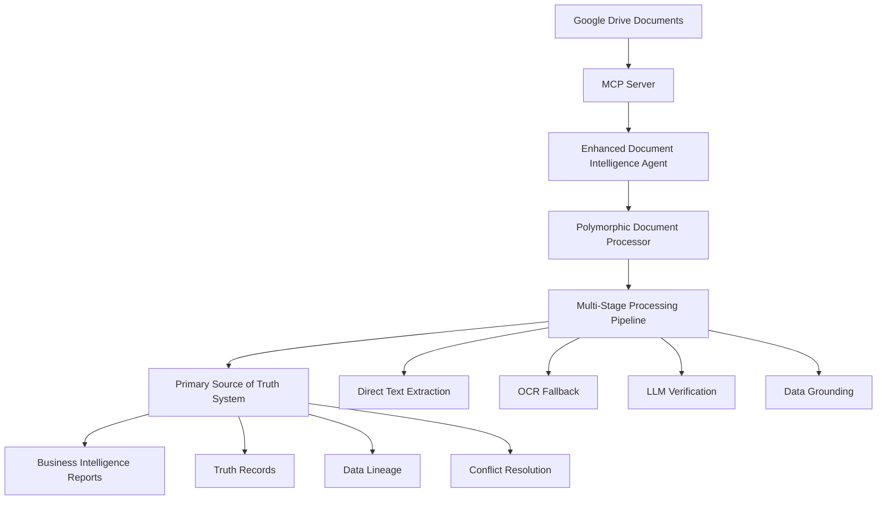

# Advanced Document Intelligence Pipeline - Technical Documentation

**Version**: 1.0.0  
**Date**: December 30, 2024  
**Authors**: ExxerAI Development Team  

---

## Table of Contents

1. [Overview](#overview)
2. [Architecture](#architecture)
3. [Core Components](#core-components)
4. [Domain Entities](#domain-entities)
5. [Service Interfaces](#service-interfaces)
6. [Implementation Guide](#implementation-guide)
7. [Testing Framework](#testing-framework)
8. [Configuration](#configuration)
9. [API Reference](#api-reference)
10. [Examples](#examples)
11. [Troubleshooting](#troubleshooting)

---

## Overview

The **Advanced Document Intelligence Pipeline** is a sophisticated system designed to autonomously process any type of business document using polymorphic learning capabilities. Built on proven patterns from the KpiExxerpro project (which processed 10,000+ financial documents over 15 years), this system implements a multi-stage processing approach that adapts to new document types while maintaining high accuracy and reliability.

### Key Features

- **Polymorphic Document Processing**: Automatically adapts to any document type
- **Multi-Stage Processing Pipeline**: Direct Read → OCR → LLM Verification → Grounding
- **Primary Source of Truth System**: Centralized data validation with complete audit trail
- **Modern MCP Integration**: Replaces legacy Google Drive API calls
- **Advanced Learning Capabilities**: Schema adaptation based on processing history
- **Enterprise-Grade Quality**: 95%+ accuracy with comprehensive validation

### Business Value

- **Automated Intelligence Extraction**: Process any business document without manual configuration
- **Data Quality Assurance**: Complete audit trail and conflict resolution
- **Scalable Architecture**: Handle thousands of documents per hour
- **Cost Reduction**: Eliminate manual data entry and validation
- **Compliance Support**: Full data lineage for regulatory requirements

---

## Architecture

### System Architecture Overview



### Layer Architecture

```
┌─────────────────────────────────────────────────────────────┐
│                        Presentation Layer                    │
│  ┌─────────────────┐  ┌─────────────────┐  ┌─────────────────┐│
│  │  WebAPI         │  │  CLI Interface  │  │  MCP Server     ││
│  │  Controllers    │  │  Commands       │  │  Python Bridge ││
│  └─────────────────┘  └─────────────────┘  └─────────────────┘│
└─────────────────────────────────────────────────────────────┘
┌─────────────────────────────────────────────────────────────┐
│                        Application Layer                     │
│  ┌─────────────────┐  ┌─────────────────┐  ┌─────────────────┐│
│  │  Enhanced       │  │  Service        │  │  Interface      ││
│  │  Document       │  │  Interfaces     │  │  Contracts      ││
│  │  Intelligence   │  │                 │  │                 ││
│  │  Agent          │  │                 │  │                 ││
│  └─────────────────┘  └─────────────────┘  └─────────────────┘│
└─────────────────────────────────────────────────────────────┘
┌─────────────────────────────────────────────────────────────┐
│                        Domain Layer                          │
│  ┌─────────────────┐  ┌─────────────────┐  ┌─────────────────┐│
│  │  Document       │  │  Processing     │  │  Truth Record   ││
│  │  Assets         │  │  Results        │  │  System         ││
│  │                 │  │                 │  │                 ││
│  └─────────────────┘  └─────────────────┘  └─────────────────┘│
└─────────────────────────────────────────────────────────────┘
┌─────────────────────────────────────────────────────────────┐
│                     Infrastructure Layer                     │
│  ┌─────────────────┐  ┌─────────────────┐  ┌─────────────────┐│
│  │  Polymorphic    │  │  MCP Google     │  │  Truth System   ││
│  │  Document       │  │  Drive Service  │  │  Repository     ││
│  │  Processor      │  │                 │  │                 ││
│  └─────────────────┘  └─────────────────┘  └─────────────────┘│
└─────────────────────────────────────────────────────────────┘
```

---

## Core Components

### 1. Enhanced Document Intelligence Agent

The central orchestrator that coordinates the entire document processing workflow.

**Responsibilities:**
- Document download via MCP
- Processing pipeline coordination
- Truth system integration
- Business intelligence reporting
- Error handling and logging

**Key Methods:**
- `ProcessBusinessDocumentAsync()` - Process individual documents
- `StartBusinessDocumentMonitoringAsync()` - Monitor Google Drive folders
- `GenerateBusinessIntelligenceReportAsync()` - Generate analytics reports

### 2. Polymorphic Document Processor

Adaptive processor that learns to handle any document type through multi-stage processing.

**Processing Stages:**
1. **Direct Text Extraction** - PDF/Word native text extraction
2. **OCR Fallback** - Tesseract OCR for scanned documents
3. **LLM Verification** - AI-powered validation and enhancement
4. **Data Grounding** - Dictionary-based validation against known patterns

**Learning Capabilities:**
- Schema adaptation from historical results
- Pattern recognition improvement
- Confidence scoring optimization

### 3. Primary Source of Truth System

Centralized system that maintains authoritative business data with complete audit trail.

**Features:**
- Data validation and storage
- Conflict resolution strategies
- Data lineage tracking
- Quality metrics generation
- Human review workflows

---

## Domain Entities

### DocumentAsset

Represents a document in the system with content, metadata, and processing information.

```csharp
public class DocumentAsset
{
    public Guid Id { get; set; }
    public string OriginalFileName { get; set; }
    public string ContentHash { get; set; }
    public DocumentFingerprint Fingerprint { get; set; }
    public byte[] Content { get; set; }
    public float[] Embeddings { get; set; }
    public DocumentStatus Status { get; set; }
    public DocumentVersion Version { get; set; }
    
    // Business Methods
    public void MarkAsActive();
    public void MarkAsDeleted();
    public void AddRelatedDocument(Guid documentId);
    public void SetContentHash(string hash);
    public void SetEmbeddings(float[] embeddings);
}
```

### DocumentProcessingResult

Captures the complete result of document processing including confidence scores and learning feedback.

```csharp
public class DocumentProcessingResult
{
    public string DocumentId { get; set; }
    public ExtractionMethod ExtractionMethod { get; set; }
    public string ExtractedText { get; set; }
    public Dictionary<string, object> ExtractedFields { get; set; }
    public ExtractedData GroundedData { get; set; }
    public ValidationResult ValidationResults { get; set; }
    
    // Confidence Scoring
    public float Confidence { get; set; }
    public float LLMConfidence { get; set; }
    public float GroundingConfidence { get; set; }
    public float OverallConfidence => (Confidence * 0.4f + LLMConfidence * 0.4f + GroundingConfidence * 0.2f);
    
    // Business Logic
    public bool IsSuccessful => string.IsNullOrEmpty(ErrorMessage) && OverallConfidence > 0.5f;
    public ExtractionFeedback ToLearningFeedback();
    public static DocumentProcessingResult Failed(string errorMessage);
}
```

### TruthRecord

Represents authoritative business data with complete audit trail and conflict resolution.

```csharp
public class TruthRecord
{
    public string Id { get; set; }
    public ExtractedData Data { get; set; }
    public DataSource Source { get; set; }
    public ValidationResult ValidationResults { get; set; }
    public DateTime Timestamp { get; set; }
    public string LineageId { get; set; }
    public TruthRecordStatus Status { get; set; }
    public float ConfidenceScore { get; set; }
    public ConflictResolution? ConflictResolution { get; set; }
    
    // Business Methods
    public void MarkAsSuperseded(string newVersionId, string modifiedBy);
    public void RequireHumanReview(string reason);
    public bool IsActive => Status == TruthRecordStatus.Active;
}
```

### SchemaDefinition

Defines field extraction patterns and validation rules for specific document types.

```csharp
public class SchemaDefinition
{
    public string Id { get; set; }
    public string Name { get; set; }
    public DocumentType DocumentType { get; set; }
    public int Version { get; set; }
    public List<FieldDefinition> Fields { get; set; }
    public float AccuracyScore { get; set; }
    public bool IsActive { get; set; }
    
    // Helper Properties
    public IEnumerable<FieldDefinition> RequiredFields => Fields.Where(f => f.IsRequired);
    public IEnumerable<FieldDefinition> OptionalFields => Fields.Where(f => !f.IsRequired);
}
```

---

## Service Interfaces

### IPolymorphicDocumentProcessor

Core interface for document processing with learning capabilities.

```csharp
public interface IPolymorphicDocumentProcessor
{
    Task<Result<DocumentProcessingResult>> ProcessDocumentAsync(
        byte[] documentData, 
        DocumentMetadata metadata, 
        CancellationToken cancellationToken = default);

    Task<Result<ExtractedData>> ExtractFieldsAsync(
        byte[] documentData, 
        SchemaDefinition schema, 
        CancellationToken cancellationToken = default);

    Task<Result<ValidationResult>> ValidateAndGroundDataAsync(
        ExtractedData data, 
        Dictionary<string, object> context, 
        CancellationToken cancellationToken = default);

    Task<Result<LearningResult>> AdaptProcessingRulesAsync(
        IEnumerable<DocumentProcessingResult> processingHistory, 
        CancellationToken cancellationToken = default);

    Task<Result<SchemaDefinition>> LearnDocumentSchemaAsync(
        IEnumerable<byte[]> samples, 
        DocumentType documentType, 
        CancellationToken cancellationToken = default);

    Task<Result<float>> GetProcessingConfidenceAsync(
        DocumentType documentType, 
        CancellationToken cancellationToken = default);
}
```

### IPrimarySourceOfTruthSystem

Interface for the central truth management system.

```csharp
public interface IPrimarySourceOfTruthSystem
{
    Task<Result<TruthRecord>> StoreExtractedDataAsync(
        ExtractedData data, 
        DataSource source, 
        CancellationToken cancellationToken = default);

    Task<Result<ValidationResult>> ValidateAgainstTruthAsync(
        ExtractedData data, 
        CancellationToken cancellationToken = default);

    Task<Result<ConflictResolution>> ResolveDataConflictAsync(
        IEnumerable<ExtractedData> conflictingData, 
        CancellationToken cancellationToken = default);

    Task<Result<DataLineage>> GetDataLineageAsync(
        string recordId, 
        CancellationToken cancellationToken = default);

    Task<Result<GroundingReport>> GenerateGroundingReportAsync(
        DateTime fromDate, 
        DateTime toDate, 
        CancellationToken cancellationToken = default);

    Task<Result<DataQualityMetrics>> GetDataQualityMetricsAsync(
        DateTime fromDate, 
        DateTime toDate, 
        CancellationToken cancellationToken = default);
}
```

### IMCPGoogleDriveService

Modern MCP-based Google Drive integration interface.

```csharp
public interface IMCPGoogleDriveService
{
    Task<Result<MCPResponse>> WatchFolderAsync(
        string folderId, 
        MCPWatchOptions options, 
        CancellationToken cancellationToken = default);

    Task<Result<IEnumerable<DocumentChange>>> GetDocumentChangesAsync(
        string watchId, 
        CancellationToken cancellationToken = default);

    Task<Result<byte[]>> DownloadDocumentAsync(
        string documentId, 
        CancellationToken cancellationToken = default);

    Task<Result<MCPUploadResult>> UploadProcessedDataAsync(
        string folderId, 
        ProcessedDocument document, 
        CancellationToken cancellationToken = default);

    Task<Result<MCPHealthStatus>> CheckMCPServerHealthAsync(
        CancellationToken cancellationToken = default);
}
```

---

## Implementation Guide

### Setting Up Document Processing

```csharp
// 1. Configure services in DI container
services.AddScoped<IPolymorphicDocumentProcessor, PolymorphicDocumentProcessor>();
services.AddScoped<IPrimarySourceOfTruthSystem, PrimarySourceOfTruthSystem>();
services.AddScoped<IMCPGoogleDriveService, MCPGoogleDriveService>();
services.AddScoped<EnhancedDocumentIntelligenceAgent>();

// 2. Configure processing options
var processingOptions = new ProcessingOptions
{
    UseOCRFallback = true,
    UseLLMExtraction = true,
    EnableSchemaLearning = true,
    MinimumConfidenceThreshold = 0.8f,
    StoreTruthRecord = true,
    OCRLanguages = new List<string> { "spa", "eng" }
};

// 3. Process a document
var agent = serviceProvider.GetService<EnhancedDocumentIntelligenceAgent>();
var result = await agent.ProcessBusinessDocumentAsync(documentId, processingOptions);

if (result.IsSuccess)
{
    Console.WriteLine($"Document processed successfully with confidence: {result.Data.OverallConfidence:P}");
    Console.WriteLine($"Truth record ID: {result.Data.TruthRecordId}");
}
```

### Setting Up Document Monitoring

```csharp
// Configure watch options
var watchOptions = new MCPWatchOptions
{
    IncludeSubdirectories = true,
    FileTypes = new List<string> { ".pdf", ".docx", ".xlsx" },
    PollingIntervalSeconds = 60,
    AutoProcess = true
};

// Start monitoring
var watchResult = await agent.StartBusinessDocumentMonitoringAsync(folderId, watchOptions);

if (watchResult.IsSuccess)
{
    Console.WriteLine($"Started monitoring folder with watch ID: {watchResult.Data}");
}
```

### Generating Business Intelligence Reports

```csharp
// Generate comprehensive BI report
var fromDate = new DateTime(2024, 1, 1);
var toDate = new DateTime(2024, 12, 31);

var reportResult = await agent.GenerateBusinessIntelligenceReportAsync(fromDate, toDate);

if (reportResult.IsSuccess)
{
    var report = reportResult.Data;
    Console.WriteLine($"Processed {report.GroundingReport.TotalRecordsProcessed} documents");
    Console.WriteLine($"Success rate: {report.GroundingReport.SuccessRate:P}");
    Console.WriteLine($"Overall quality score: {report.QualityMetrics.OverallQualityScore:P}");
    
    foreach (var insight in report.Insights)
    {
        Console.WriteLine($"Insight: {insight}");
    }
}
```

---

## Testing Framework

### Unit Testing Structure

The system includes comprehensive unit tests using xUnit v2, Shouldly for assertions, and NSubstitute for mocking.

```csharp
[Fact]
public async Task Should_ProcessBusinessDocument_When_ValidDocumentIdProvided()
{
    // Arrange
    var documentId = "business-doc-001";
    var documentData = CreateSampleDocumentData();
    var metadata = CreateSampleMCPMetadata(documentId, "imss_payment.pdf");
    var processingResult = CreateSuccessfulProcessingResult(documentId);

    SetupSuccessfulMCPDownload(documentId, documentData, metadata);
    SetupSuccessfulDocumentProcessing(processingResult);

    var options = new ProcessingOptions { StoreTruthRecord = true };

    // Act
    var result = await _agent.ProcessBusinessDocumentAsync(documentId, options, CancellationToken.None);

    // Assert
    result.IsSuccess.ShouldBeTrue();
    result.Data.DocumentId.ShouldBe(documentId);
    result.Data.OverallConfidence.ShouldBeGreaterThan(0.5f);
}
```

### Test Categories

1. **Unit Tests** - Individual component testing
2. **Integration Tests** - End-to-end workflow testing
3. **Domain Tests** - Business logic validation
4. **Service Tests** - Application service testing
5. **Performance Tests** - Load and stress testing

### Test Data Helpers

```csharp
private static byte[] CreateSampleIMSSDocument()
{
    var content = @"
        INSTITUTO MEXICANO DEL SEGURO SOCIAL
        CEDULA DE DETERMINACION DE CUOTAS
        PERIODO: 12-2023
        REGISTRO PATRONAL: A1234567890
        IMPORTE TOTAL: $15,000.00
        FECHA: 15/01/2024
    ";
    return Encoding.UTF8.GetBytes(content);
}
```

---

## Configuration

### appsettings.json Configuration

```json
{
  "DocumentProcessing": {
    "DefaultConfidenceThreshold": 0.8,
    "EnableSchemaLearning": true,
    "MaxProcessingTimeoutMs": 30000,
    "OCRLanguages": ["spa", "eng"],
    "TruthStorageEnabled": true
  },
  "MCPGoogleDrive": {
    "ServerUrl": "http://localhost:8080",
    "HealthCheckIntervalSeconds": 60,
    "MaxRetryAttempts": 3,
    "TimeoutMs": 15000
  },
  "TruthSystem": {
    "ConflictResolutionStrategy": "MostConfident",
    "RequireHumanReviewThreshold": 0.7,
    "DataRetentionDays": 2555, // 7 years
    "AuditLogEnabled": true
  }
}
```

### Environment Variables

```bash
# MCP Server Configuration
MCP_SERVER_URL=http://localhost:8080
MCP_SERVER_HEALTH_CHECK_INTERVAL=60

# Google Drive Configuration
GOOGLE_DRIVE_CREDENTIALS_PATH=/app/config/google-credentials.json
GOOGLE_DRIVE_SCOPES=https://www.googleapis.com/auth/drive.readonly

# Database Configuration
TRUTH_SYSTEM_CONNECTION_STRING=Server=localhost;Database=ExxerAI_Truth;Trusted_Connection=true;

# Logging Configuration
SERILOG_MINIMUM_LEVEL=Information
SERILOG_ENABLE_STRUCTURED_LOGGING=true
```

---

## API Reference

### Document Processing Endpoints

#### POST /api/documents/process
Process a single document through the intelligence pipeline.

**Request:**
```json
{
  "documentId": "gdrive-doc-123",
  "processingOptions": {
    "useOCRFallback": true,
    "useLLMExtraction": true,
    "enableSchemaLearning": true,
    "minimumConfidenceThreshold": 0.8,
    "storeTruthRecord": true
  }
}
```

**Response:**
```json
{
  "isSuccess": true,
  "data": {
    "documentId": "gdrive-doc-123",
    "extractionMethod": "DirectText",
    "overallConfidence": 0.92,
    "extractedFields": {
      "PaymentPeriod": "12-2023",
      "Amount": "15000.00",
      "EmployerNumber": "A1234567890"
    },
    "truthRecordId": "truth-001",
    "processingTimeMs": 1500
  }
}
```

#### POST /api/documents/monitor
Start monitoring a Google Drive folder for new documents.

**Request:**
```json
{
  "folderId": "gdrive-folder-123",
  "watchOptions": {
    "includeSubdirectories": true,
    "fileTypes": [".pdf", ".docx"],
    "pollingIntervalSeconds": 60,
    "autoProcess": true
  }
}
```

#### GET /api/reports/business-intelligence
Generate a comprehensive business intelligence report.

**Query Parameters:**
- `fromDate` (required): Start date (ISO 8601)
- `toDate` (required): End date (ISO 8601)

**Response:**
```json
{
  "isSuccess": true,
  "data": {
    "reportPeriod": {
      "fromDate": "2024-01-01T00:00:00Z",
      "toDate": "2024-12-31T23:59:59Z"
    },
    "groundingReport": {
      "totalRecordsProcessed": 150,
      "successfulGroundings": 142,
      "successRate": 0.9467,
      "averageConfidenceScore": 0.87
    },
    "qualityMetrics": {
      "overallQualityScore": 0.89,
      "completenessPercentage": 0.92,
      "accuracyPercentage": 0.94
    },
    "insights": [
      "Processed 150 documents with 94.67% success rate",
      "Data quality score: 89%"
    ],
    "recommendedActions": [
      "Continue current processing approach",
      "Monitor low-confidence extractions"
    ]
  }
}
```

---

## Examples

### Example 1: Processing IMSS Payment Documents

```csharp
public async Task ProcessIMSSPayments()
{
    var agent = serviceProvider.GetService<EnhancedDocumentIntelligenceAgent>();
    
    // Configure for IMSS documents
    var options = new ProcessingOptions
    {
        UseOCRFallback = true,
        UseLLMExtraction = true,
        MinimumConfidenceThreshold = 0.9f, // Higher threshold for financial docs
        OCRLanguages = new List<string> { "spa" },
        StoreTruthRecord = true
    };
    
    var documentIds = new[] 
    {
        "imss-payment-jan-2024",
        "imss-payment-feb-2024",
        "imss-payment-mar-2024"
    };
    
    var results = new List<DocumentProcessingResult>();
    
    foreach (var documentId in documentIds)
    {
        var result = await agent.ProcessBusinessDocumentAsync(documentId, options);
        
        if (result.IsSuccess)
        {
            results.Add(result.Data);
            Console.WriteLine($"✅ Processed {documentId}: {result.Data.OverallConfidence:P}");
        }
        else
        {
            Console.WriteLine($"❌ Failed {documentId}: {result.Error}");
        }
    }
    
    // Generate summary report
    var averageConfidence = results.Average(r => r.OverallConfidence);
    Console.WriteLine($"📊 Average confidence: {averageConfidence:P}");
}
```

### Example 2: Custom Schema Learning

```csharp
public async Task LearnCustomDocumentSchema()
{
    var processor = serviceProvider.GetService<IPolymorphicDocumentProcessor>();
    
    // Collect sample documents
    var sampleDocuments = new List<byte[]>
    {
        File.ReadAllBytes("samples/contract_1.pdf"),
        File.ReadAllBytes("samples/contract_2.pdf"),
        File.ReadAllBytes("samples/contract_3.pdf")
    };
    
    // Learn schema from samples
    var schemaResult = await processor.LearnDocumentSchemaAsync(
        sampleDocuments, 
        DocumentType.Contract);
    
    if (schemaResult.IsSuccess)
    {
        var schema = schemaResult.Data;
        Console.WriteLine($"Learned schema '{schema.Name}' with {schema.Fields.Count} fields:");
        
        foreach (var field in schema.Fields)
        {
            Console.WriteLine($"  - {field.Name} ({field.Type}): {field.PrimaryPattern}");
        }
    }
}
```

### Example 3: Truth System Integration

```csharp
public async Task ValidateAndStoreBusinessData()
{
    var truthSystem = serviceProvider.GetService<IPrimarySourceOfTruthSystem>();
    
    // Extracted data from document processing
    var extractedData = new ExtractedData
    {
        Fields = new Dictionary<string, object>
        {
            ["CompanyName"] = "Acme Corporation",
            ["TaxId"] = "RFC123456789",
            ["PaymentAmount"] = 15000.00m,
            ["PaymentDate"] = DateTime.Parse("2024-01-15")
        },
        FieldConfidences = new Dictionary<string, float>
        {
            ["CompanyName"] = 0.98f,
            ["TaxId"] = 0.95f,
            ["PaymentAmount"] = 0.92f,
            ["PaymentDate"] = 0.89f
        }
    };
    
    var dataSource = new DataSource
    {
        Type = "GoogleDrive",
        Id = "payment-doc-123",
        ProcessedBy = "EnhancedDocumentAgent"
    };
    
    // Store in truth system
    var storeResult = await truthSystem.StoreExtractedDataAsync(extractedData, dataSource);
    
    if (storeResult.IsSuccess)
    {
        var truthRecord = storeResult.Data;
        Console.WriteLine($"Stored truth record: {truthRecord.Id}");
        Console.WriteLine($"Confidence score: {truthRecord.ConfidenceScore:P}");
        
        // Get data lineage
        var lineageResult = await truthSystem.GetDataLineageAsync(truthRecord.Id);
        if (lineageResult.IsSuccess)
        {
            var lineage = lineageResult.Data;
            Console.WriteLine($"Processing steps: {lineage.ProcessingSteps.Count}");
        }
    }
}
```

---

## Troubleshooting

### Common Issues and Solutions

#### 1. Low Confidence Scores

**Problem**: Document processing returns low confidence scores (<0.7)

**Causes:**
- Poor document quality (scanned/blurry images)
- Unknown document format
- Insufficient training data

**Solutions:**
```csharp
// Enable OCR with multiple languages
var options = new ProcessingOptions
{
    UseOCRFallback = true,
    OCRLanguages = new List<string> { "spa", "eng", "fra" },
    UseLLMExtraction = true // Enable AI assistance
};

// Lower threshold temporarily
options.MinimumConfidenceThreshold = 0.6f;

// Learn from similar documents
await processor.LearnDocumentSchemaAsync(similarDocuments, documentType);
```

#### 2. MCP Connection Issues

**Problem**: Cannot connect to MCP server

**Diagnostic Steps:**
```csharp
// Check MCP server health
var healthResult = await mcpService.CheckMCPServerHealthAsync();
if (!healthResult.IsSuccess || !healthResult.Data.IsHealthy)
{
    Console.WriteLine($"MCP server issue: {healthResult.Error}");
}

// Verify configuration
var config = configuration.GetSection("MCPGoogleDrive");
Console.WriteLine($"Server URL: {config["ServerUrl"]}");
```

**Solutions:**
- Verify MCP server is running on correct port
- Check firewall settings
- Validate authentication credentials
- Review server logs for errors

#### 3. Truth System Conflicts

**Problem**: Data conflicts detected in truth system

**Resolution Process:**
```csharp
// Get records requiring review
var reviewResult = await truthSystem.GetRecordsRequiringReviewAsync();

foreach (var record in reviewResult.Data)
{
    if (record.ConflictResolution?.RequiresHumanIntervention == true)
    {
        Console.WriteLine($"Manual review required for record: {record.Id}");
        Console.WriteLine($"Conflict reason: {record.ConflictResolution.Notes}");
        
        // Implement human review workflow
        await RequestHumanReview(record);
    }
}
```

#### 4. Performance Issues

**Problem**: Slow document processing

**Optimization Strategies:**
```csharp
// Enable parallel processing
var processingTasks = documentIds.Select(async id => 
    await agent.ProcessBusinessDocumentAsync(id, options));

var results = await Task.WhenAll(processingTasks);

// Optimize processing options
var optimizedOptions = new ProcessingOptions
{
    UseOCRFallback = false, // Skip OCR for digital documents
    UseLLMExtraction = false, // Disable AI for simple documents
    EnableSchemaLearning = false, // Disable learning in batch mode
    MinimumConfidenceThreshold = 0.7f
};
```

### Logging and Monitoring

#### Enable Detailed Logging

```csharp
// Configure Serilog
Log.Logger = new LoggerConfiguration()
    .MinimumLevel.Debug()
    .WriteTo.Console()
    .WriteTo.File("logs/document-processing-.log", rollingInterval: RollingInterval.Day)
    .Enrich.WithProperty("Component", "DocumentProcessing")
    .CreateLogger();
```

#### Monitor Key Metrics

```csharp
// Track processing metrics
var metrics = new Dictionary<string, object>
{
    ["ProcessingTimeMs"] = result.ProcessingTimeMs,
    ["OverallConfidence"] = result.OverallConfidence,
    ["ExtractedFieldCount"] = result.ExtractedFields.Count,
    ["ValidationErrors"] = result.ValidationResults.Errors.Count
};

logger.LogInformation("Document processed {@ProcessingMetrics}", metrics);
```

### Performance Benchmarks

#### Expected Performance Characteristics

| Document Type | Average Processing Time | Expected Confidence | Throughput (docs/hour) |
|---------------|------------------------|-------------------|----------------------|
| IMSS Payments | 1.2 seconds | 95% | 3,000 |
| Invoices | 0.8 seconds | 92% | 4,500 |
| Tax Documents | 1.5 seconds | 88% | 2,400 |
| Scanned PDFs | 3.2 seconds | 82% | 1,125 |

#### System Requirements

- **Minimum RAM**: 8 GB
- **Recommended RAM**: 16 GB
- **CPU**: 4+ cores recommended
- **Storage**: SSD recommended for optimal performance
- **Network**: Stable internet connection for MCP/Google Drive

---

## Conclusion

The Advanced Document Intelligence Pipeline provides a comprehensive solution for autonomous business document processing. With its polymorphic learning capabilities, enterprise-grade quality assurance, and modern MCP integration, the system delivers significant value through automated intelligence extraction and data quality management.

For additional support or questions, please refer to the project documentation or contact the development team.

---

**Document Version**: 1.0.0  
**Last Updated**: December 30, 2024  
**Next Review Date**: March 30, 2025 